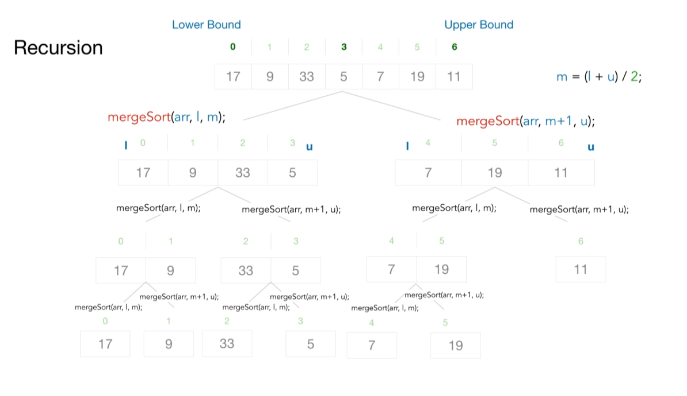
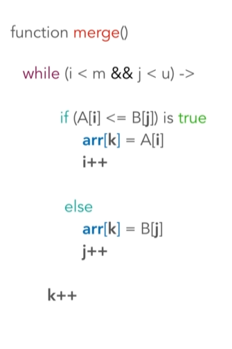
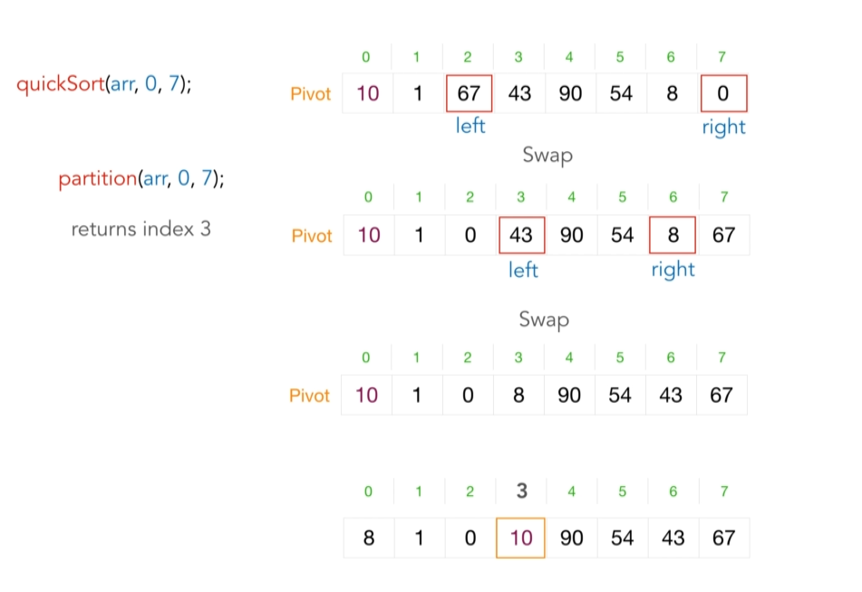
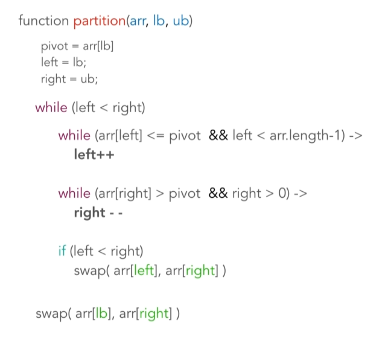

The Divide and conquer technique solves a problem by dividing it into little easily solvable  subproblems and conquering those subprobles by solving them recursively the combining the result.

A problem to be solved by the divide conquer technique is identified if it generates two or more subproblems of same kind that can be solved recursively and then combined back for a global result. Examples include merge sort, quick sort and binary search.

Problem 01: Merge Sort
- Sorting the array through dividing the array into smaller halves until you can't divide the array any longer.

Algorithm solution

Time Complexity: O(nlogn) time
Space Complexity: O(n) space

Problem 02: Quick Sort
- The array is sorted through finding a key element in the array called the pivot then partitioning the unsorted array around this pivot such that all elements in the array smaller than the pivot go to the left while the greater ones go to the right. You then continue choosing a new pivot and partitioning until the array is sorted.

Algorithm solution

Time Complexity: O(n**2) time
Space Complexity: O(n) space