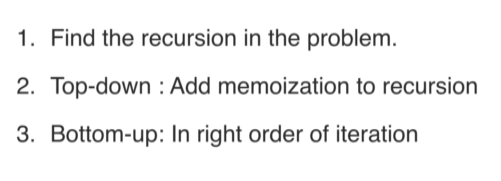
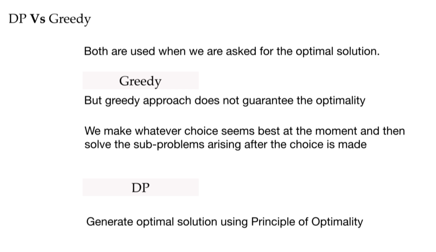
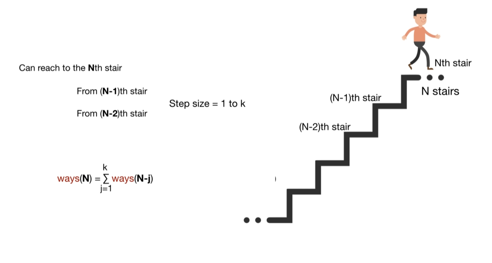
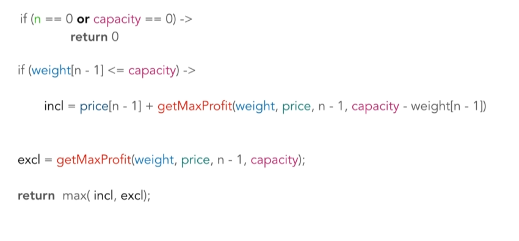
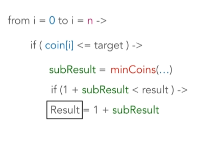
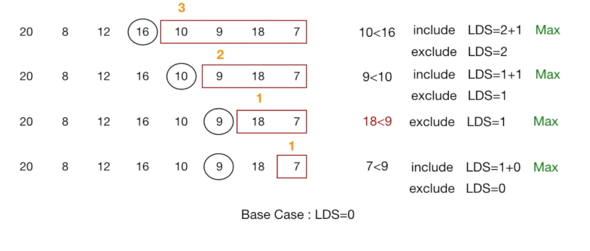
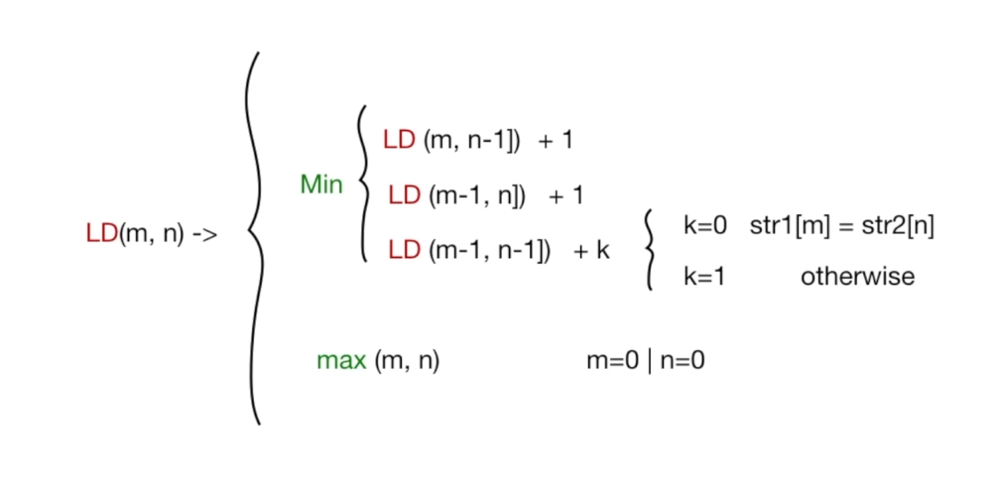
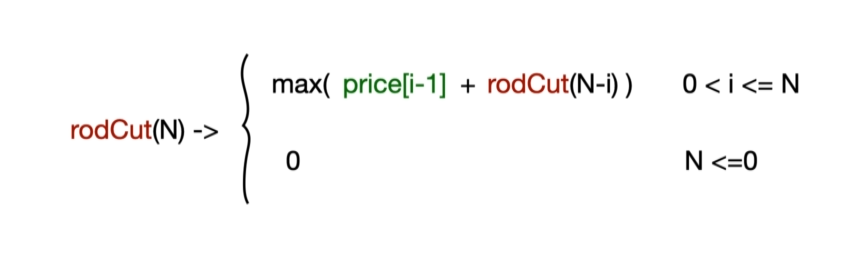
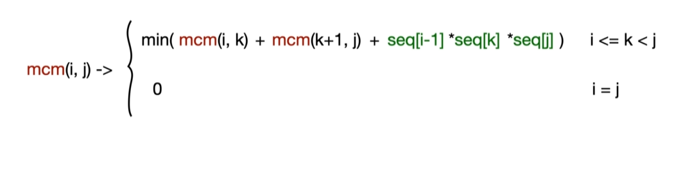

Dynamic Programming is an algorithmic technique for solving an optimization problem by breaking it down into simpler subproblems and utilizing the fact that the optimal solution to the overall problem depends upon the optimal solution to its subproblems.

-Identifying a problem that can be solved using dynamic programming:

A problem needs to be broken down into smaller subproblems.
Problem demads for optimal solution.

Difference between DP and the greedy technique:

Problem 01: Staircase Problem
- There exists a staircase with N steps, and you can climb up either 1 or 2 steps at a time.

- Given N, write a function that returns the number of unique ways you can climb the staircase.
The order of the steps matters.

Solution

Recursion:

Time Complexity: O(3**n) time
Space Complexity: O(n) space

Top-down:

Time Complexity: O(n) time
Space Complexity: O(n) space

Bottom-up:

Time Complexity: O(n) time
Space Complexity: O(n) space

Problem 02: Knapsack Problem
- Given a set of items, each with a weight and a value, determine the number of each item to include in a collection so that the total weight is less than or equal to a given limit and the total value is as large as possible.

Solution

Recursion:

Time Complexity: O(2**n) time
Space Complexity: O(n) space

Top-down:

Time Complexity: O(nw) time
Space Complexity: O(nw) space

Bottom-up:

Time Complexity: O(nw) time
Space Complexity: O(nw) space

Problem 03: Coin Change Problem
- Given an amount and the denominations of coins available, determine how many ways change can be made for amount. There is a limitless supply of each coin type.

Solution

Recursion: 

Time Complexity: O(M**A) time
Space Complexity: O(A) space

Top-down: 

Time Complexity: O(MA) time
Space Complexity: O(A) space

Bottom-up: 

Time Complexity: O(M**A) time
Space Complexity: O(A) space

Problem 04: Longest decreasing subsequence
- The task is to find the length of the longest subsequence in a given array of integers such that all elements of the subsequence are sorted in descending order.

Solution

Recursion: 

Time Complexity: O(2**n) time
Space Complexity: O(n) space

Top-down: 

Time Complexity: O(n**2) time
Space Complexity: O(n**2) space

Bottom-up: 

Time Complexity: O(n**2) time
Space Complexity: O(n) space

Problem 05: Levenstein problem
- The minimum number of changes required to convert string a into string b (this is done by inserting, deleting or replacing a character in string a).

Solution

Recursion: 

Time Complexity: O(3**n) time
Space Complexity: O(m*n) space

Top-down: 

Time Complexity: O(m*n) time
Space Complexity: O(m*n) space

Bottom-up: 

Time Complexity: O(m*n) time
Space Complexity: O(m*n) space

Problem 06: Rod Cutting problem
- Given a rod of length n, and an array that contains the prices of all the pieces smaller than n, determine the maximum profit you could obtain from cutting up the rod and selling its pieces.

Solution

Recursion: 

Time Complexity: O(2**(n-1)) time
Space Complexity: O(n) space

Top-down: 

Time Complexity: O(n**2) time
Space Complexity: O(n) space

Bottom-up: 

Time Complexity: O(n**2) time
Space Complexity: O(n) space

Problem 07: Matrix chain multiplication
- Given a sequence of matrices, find the most efficient way to multiply these matrices together.
- The problem is not actually to perform the multiplications, but merely to decide in which order to perform the multiplications.
- We have many options to multiply a chain of matrices because matrix multiplication is associative.

Solution

Recursion: 

Time Complexity: O(2**n) time
Space Complexity: O(n) space

Top-down: 

Time Complexity: O(n**3) time
Space Complexity: O(n**2) space

Bottom-up: 

Time Complexity: O(n**3) time
Space Complexity: O(n**2) space

