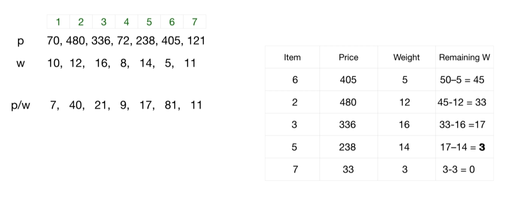
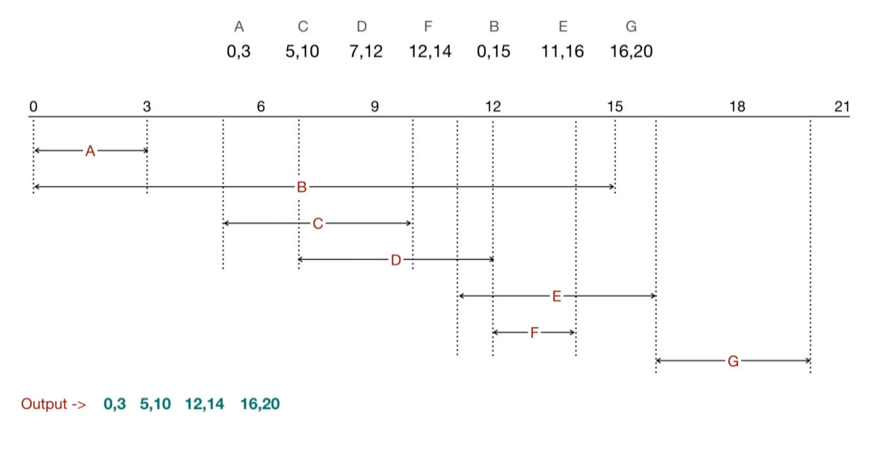
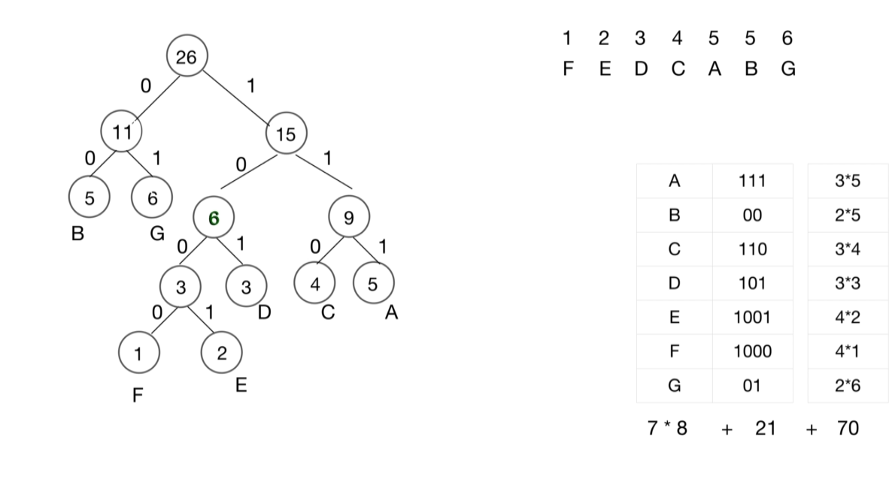

The greedy algorithm makes the choice that seems to be the best at the moment. 

It makes a locally-optimal choice in the hope that this choice will lead to a globally-optimal solution. 

The greedy algorithm is hard to check for correctness but very efficient in terms of time complexity.

One applies the greedy algorithm if the subproblem sets of aproblem are very independent from each other.

Problem 01: Fractional Knapsack
- Given a set of items, each with a weight and a value, determine the number of each item to include in a collection so that the total weight is less than or equal to a given limit and the total value is as large as possible.

Solution

Time Complexity: O(n*log(n)) time
Space Complexity: O(1) space

Problem 02: Interval Scheduling
- Consider a set of tasks. Each task is represented by an interval describing the time in which it needs to be executed. 
- The interval scheduling maximization problem (ISMP) is to find a largest compatible set - a set of non-overlapping intervals of maximum size.

Solution

Time Complexity: O(n*log(n)) time
Space Complexity: O(n) space

Problem 03: Huffman coding
- The idea is to assign variable-length codes to input characters, lengths of the assigned codes are based on the frequencies of corresponding characters. 
- The most frequent character gets the smallest code and the least frequent character gets the largest code.

Solution

Time Complexity: O(n*log(k)) time
Space Complexity: O(k) space