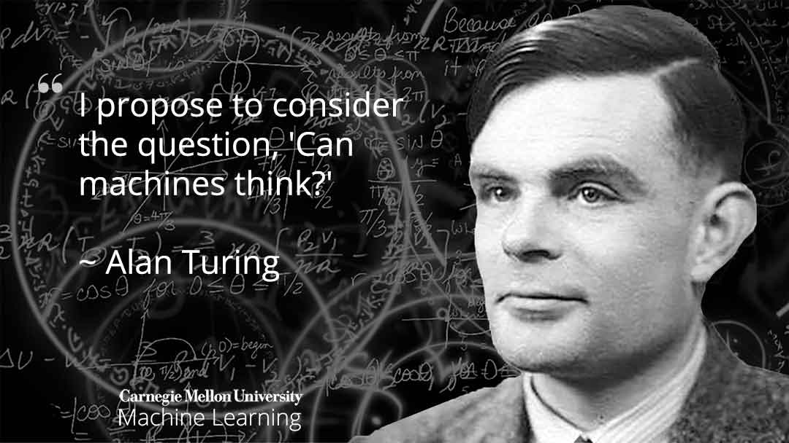

Algorithm design techniques in Javascript

Algorithmic complexity depends how much data  is processed by the function/algorithm and how fast the algorithm runs as input size increases.

The units used to analyse complexity are:
- No. of elementary operations(time complexity)
- No. of memory slots (space complexity)

Big O notation is used to classify algorithms according to their runtime or space requirements grow as the input size grows.

Example Complexity values

- O(1) constant time complexity
- O(log(N)) Logarithmic time complexity
- O(N) Linear time complexity
- O(N**2) Quadratic time complexity
- O(2**N) Exponential time complexity
- O(N!) Factorial time complexity

When solving complexities, using asymptotic analysis, smaller complexity values can be eliminated at larger inputs, larger complexity values becomes gigantic as compared to smaller ones.

