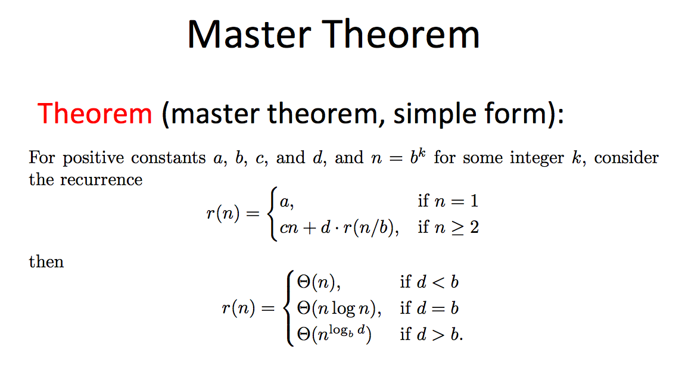

A recurrence relation is an equation that defines a sequence based on a rule that gives the next term as a function of the previous term(s).

Examples of recurrence relations:
- Fibonacci sequence
    
    fib(n) = fib(n-1) + fib(n-2)

- Factorial sequence

    n! = n*(n-1)!

A recursive algorithm is an implementation of recurrence relation.

A recurrence relation can be used to know the complexity of recursive steps.

Masters Theorem:
The master theorem is used in calculating the time complexity of recurrence relations (divide and conquer algorithms) in a simple and quick way.

If a ≥ 1 and b > 1 are constants and f(n) is an asymptotically positive function, then the time complexity of a recursive relation is given by:

