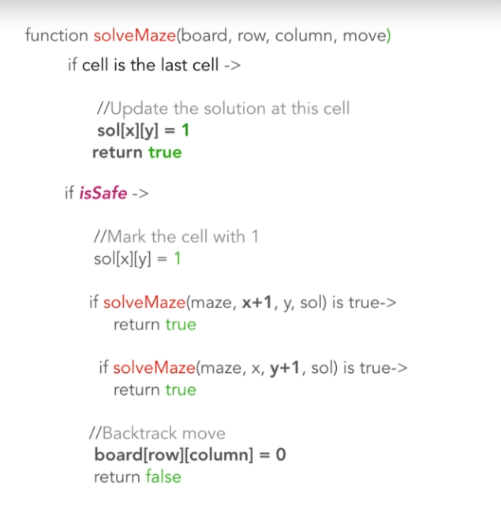
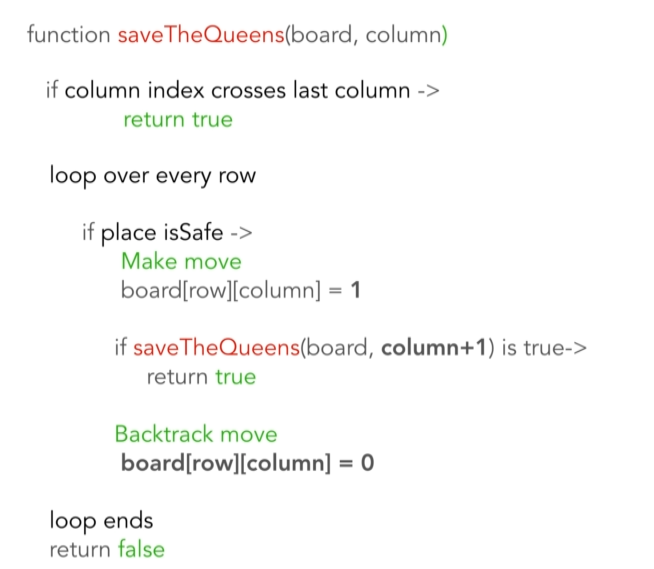

Backtracking is the technique to solve a problem recursively by making series of choices and if any of the choice fails we abandon the choice and try a different one.

Given a problem statement, you will be making decision-making calls(recursion) with given choices and constraints. If decision doesn't work, step back and make another decision with different choice.

Difference between backtracking and recursion

Problem 01: Rat in maze
- Choices - go in x direction or go in y direction
- Constraints - rat can only move in cell having value 1 and column value must be inside of maze and row value must be inside of maze.
- Recursion - influenced by choices and constraints. Go in x direction or go in y direction or if all choices fails then for the current cell the last choice always is to discard or undo the already set value. (backtracking step)
- Goal - if rat reaches to the lower right most cell

Algorithm solution

Time Complexity: O(2**(n**2)) time
Space Complexity: O(n**2) space

Problem 02: N-Queens
- Choices - queens to be placed in 4*4 board in a way no two queens attack each other
- Constraints - queen can move horizontally, vertically and diagonally

Algorithm solution

Time Complexity: O(n!) time
Space Complexity: O(n) space

Problem 03: Knight tour problem
- Choices - knight moves 8 squares from original position in an 8*8 board.
- Constraints - visiting each square once.

Algorithm solution

Time Complexity: O(8**(n**2)) time
Space Complexity: O(n**2) space