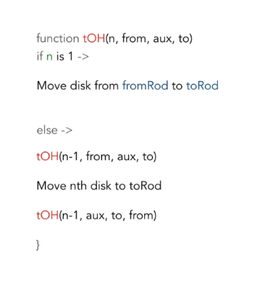
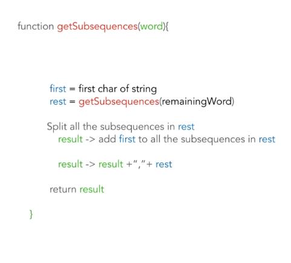
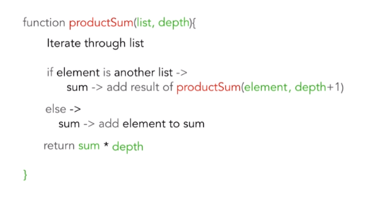
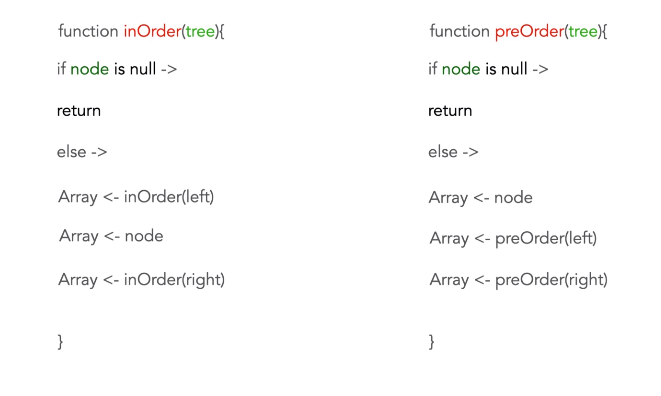

Recursion uses a call stack to solve a problem. A base condition needs to be defined to prevent infinite recursion. A problem needs to be broken down into subproblems. Use the value from the previous subproblem to construct solution of the original problem. 

Problem 01: Tower of Hanoi

Algorithm solution

Time Complexity: O(2**n) time
Space Complexity: O(n) space

Problem 02: Finding Substrings

Algorithm solution

Time Complexity: O(2**n) time
Space Complexity: O(n) space

Problem 03: Array Product Sum

Algorithm solution

Time Complexity: O(N) time
Space Complexity: O(d) space where d is the depth

Problem 04: Binary Subtree

Algorithm solution

Time Complexity: O(n+m) time
Space Complexity: O(n+m) space

